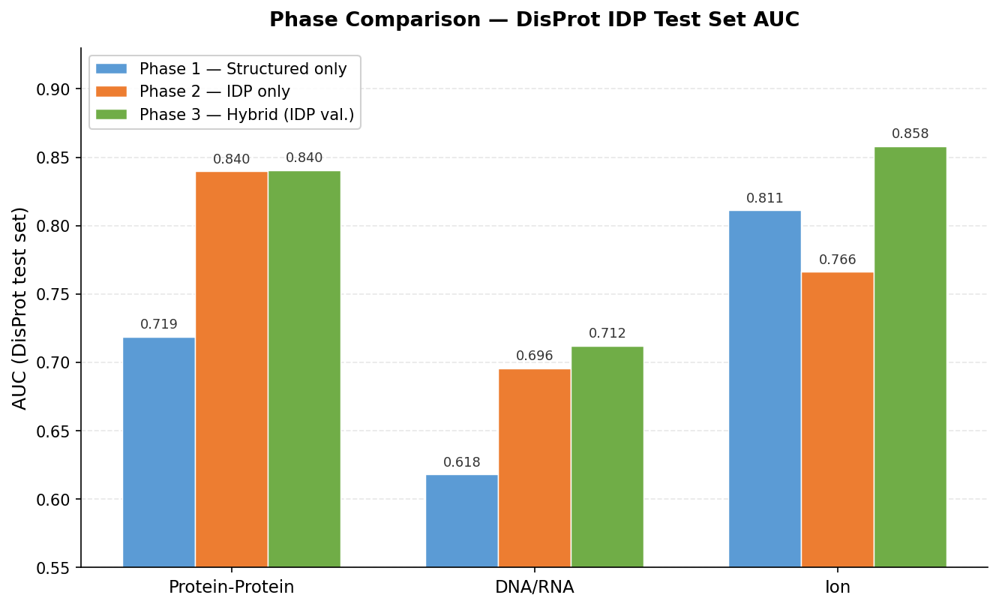

# Results Summary

This document summarizes the implementation, data statistics, and model performance for each task in the project specification. The project investigates whether hybrid training - combining binding site data from structured proteins with IDP binding data from DisProt - improves binding site prediction in intrinsically disordered protein regions.

Task numbering follows the project specification (included at [docs/specification.pdf](specification))

Three training phases were tested for each binding type:

| Phase | Training Data | Validation Data | Purpose |
|---|---|---|---|
| Phase 1 | Structured only (AHoJ-DB / BioLiP / ScanNet) | Mixed | Baseline on structured data |
| Phase 2 | IDP only (DisProt) | DisProt | Baseline on IDP data |
| Phase 3 (Hybrid) | Structured + DisProt | DisProt only | Research hypothesis |

---

## Table of Contents
- [Task 1: Data Collection and Preprocessing](#task-1-data-collection-and-preprocessing)
- [Task 2: Feature Extraction](#task-2-feature-extraction)
- [Task 3: Neural Network Model Development](#task-3-neural-network-model-development)
- [Task 4: Model Training and Evaluation](#task-4-model-training-and-evaluation)
- [Task 5: Research Documentation](#task-5-research-documentation)
- [Overall Conclusions](#overall-conclusions)

---

## Task 1: Data Collection and Preprocessing

**Implementation:** `src/prepare_data/`, `src/staticp_old/`, `src/other_codes/`, `src/idp_old/`  
Full step-by-step pipeline: [docs/data_preparation.md](data_preparation.md)

### Data Sources and Collection

Three binding categories were collected from complementary structured and IDP databases:

| Binding Type | Structured Source | IDP Source |
|---|---|---|
| Ion | AHoJ-DB (pocket_residues.csv per entry) | DisProt (ion binding GO terms) |
| DNA/RNA | BioLiP (BioLiP_nr.txt annotation file) | DisProt (DNA/RNA binding GO terms) |
| Protein-Protein | ScanNet PPBS (labels_train.txt format) | DisProt (protein binding GO terms) |

### Dataset Statistics

**Structured datasets (used as Phase 1 training data):**

| Dataset | Train | Val | Test | Train Positive % |
|---------|-------|-----|------|-----------------|
| AHoJ-DB (Ion) | 40,425,126 | 8,897,271 | 8,998,264 | 1.6% |
| BioLiP (DNA/RNA) | 761,984 | 159,405 | 157,317 | 6.1% |
| ScanNet (Protein) | 1,058,012 | 219,052 | 222,189 | 18.2% |

**IDP datasets (DisProt, used as Phase 2 training and test data):**

| Dataset | Train | Val | Test | Train Positive % |
|---------|-------|-----|------|-----------------|
| DisProt Ion | 22,674 | 4,940 | 4,112 | 43.0% |
| DisProt DNA/RNA | 38,657 | 11,149 | 9,919 | 34.4% |
| DisProt Protein | 263,522 | 49,769 | 56,974 | 29.6% |

**Train/val/test split sizes (residues, 70/15/15 at cluster level):**

| Source | Split | Total Residues | Binding | Non-Binding | Positive % |
|--------|-------|---------------|---------|-------------|------------|
| ScanNet | Train | 1,058,012 | 192,956 | 865,056 | 18.2% |
| ScanNet | Val | 219,052 | 39,477 | 179,575 | 18.0% |
| ScanNet | Test | 222,189 | 40,560 | 181,629 | 18.3% |
| DisProt Protein | Train | 263,522 | 78,032 | 185,490 | 29.6% |
| DisProt Protein | Val | 49,769 | 14,238 | 35,531 | 28.6% |
| DisProt Protein | Test | 56,974 | 15,360 | 41,614 | 27.0% |
| **Protein Combined** | **Total** | **1,869,518** | **380,623** | **1,488,895** | **20.4%** |
| BioLiP | Train | 761,984 | 46,560 | 715,424 | 6.1% |
| BioLiP | Val | 159,405 | 10,101 | 149,304 | 6.3% |
| BioLiP | Test | 157,317 | 10,034 | 147,283 | 6.4% |
| DisProt DNA/RNA | Train | 38,657 | 13,313 | 25,344 | 34.4% |
| DisProt DNA/RNA | Val | 11,149 | 4,968 | 6,181 | 44.6% |
| DisProt DNA/RNA | Test | 9,919 | 3,506 | 6,413 | 35.3% |
| **DNA/RNA Combined** | **Total** | **1,138,431** | **88,482** | **1,049,949** | **7.8%** |
| AHoJ-DB | Train | 40,425,126 | 635,694 | 39,789,432 | 1.6% |
| AHoJ-DB | Val | 8,897,271 | 138,442 | 8,758,829 | 1.6% |
| AHoJ-DB | Test | 8,998,264 | 135,132 | 8,863,132 | 1.5% |
| DisProt Ion | Train | 22,674 | 9,748 | 12,926 | 43.0% |
| DisProt Ion | Val | 4,940 | 1,118 | 3,822 | 22.6% |
| DisProt Ion | Test | 4,112 | 955 | 3,157 | 23.2% |
| **Ion Combined** | **Total** | **58,352,387** | **921,089** | **57,431,298** | **1.6%** |
| **Grand Total** | **All** | **61,360,336** | **1,390,194** | **59,970,142** | **2.3%** |

*Structured dataset val/test sizes from evaluation script output.

*Note: Train/val figures are estimates derived from test set sizes using the 70/15/15 ratio. Exact counts vary because splits are done at the cluster level, not residue level.*

### Data Processing Steps

**Sequence clustering** was applied using MMseqs2 at 10% sequence identity to prevent data leakage between splits. All splits are assigned at the cluster level — no two sequences with >10% identity appear in different splits.

**CAID3 contamination filtering** was applied to remove training sequences similar to the official benchmark test set, ensuring unbiased final evaluation.

**Class imbalance** varies significantly across datasets. The AHoJ-DB ion dataset has the most extreme imbalance (66:1 negative-to-positive ratio), while DisProt datasets are far more balanced (~3:1) because DisProt specifically annotates disordered binding regions.

---

## Task 2: Feature Extraction

**Implementation:** `src/prepare_data/generate_embeddings.py`, `src/base_codes/generate_embeddings_ion.py`, `src/base_codes/generate_embeddings_dna_rna.py`

### ESM-2 Embeddings

All protein sequences were processed through the ESM-2 protein language model (`esm2_t33_650M_UR50D`, 650M parameters) to generate per-residue contextual embeddings. Representations were extracted from layer 33 (the final layer), producing a 1280-dimensional vector for each residue.

| Parameter | Value |
|-----------|-------|
| Model | esm2_t33_650M_UR50D |
| Embedding layer | 33 (final) |
| Embedding dimension | 1280 per residue |
| Maximum sequence length | 2000 residues (longer sequences skipped to prevent GPU out-of-memory errors; this is a hardware constraint, not the model's architectural limit) |
| Output format | .npz (float32 arrays) |

**Why ESM-2:** Structure-based methods cannot be applied to IDPs because disordered regions lack stable 3D coordinates. ESM-2 operates purely on sequence, making it suitable for both structured and disordered proteins. The 650M parameter model provides a strong balance between representation quality and computational cost.

**Storage:** The complete set of embedding files requires approximately 50GB of disk space.

---

## Task 3: Neural Network Model Development

**Implementation:** `src/architecture_tests/`, `src/parameter_testing/`

### Model Architecture

The primary model (`BindingNet`) is a four-layer MLP operating on single-residue ESM-2 embeddings:

```
Input (1280) → Linear(512) → ReLU → Dropout(0.5)
             → Linear(256) → ReLU → Dropout(0.5)
             → Linear(128) → ReLU → Dropout(0.3)
             → Linear(1)   → [BCEWithLogitsLoss]
```

Each residue is classified independently. The model receives a single 1280-dimensional ESM-2 embedding as input and outputs a scalar logit, which is converted to a probability via sigmoid. The decision threshold is optimised on the validation set by maximising F1 score, rather than fixed at 0.5.

### Architecture Comparison

Four architectures were evaluated on the protein-protein binding task (DisProt test set, 20 epochs):

| Architecture | AUC | AUPRC | MCC | F1 | Training Time |
|---|---|---|---|---|---|
| **MLP (selected)** | **0.8428** | **0.6262** | **0.5071** | **0.6517** | **1.5 min** |
| Bi-GRU | 0.8283 | 0.5871 | 0.4780 | 0.6323 | 2.2 min |
| 1D CNN | 0.8265 | 0.6139 | 0.4730 | 0.6292 | 9.5 min |
| Bi-LSTM | 0.8214 | 0.5816 | 0.4645 | 0.6234 | 2.8 min |

**CNN and Recurrent vs MLP baseline:**

| Architecture | Δ AUC | Δ AUPRC | Δ MCC | Δ F1 |
|---|---|---|---|---|
| 1D CNN | -0.0163 | -0.0123 | -0.0341 | -0.0225 |
| Bi-LSTM | -0.0214 | -0.0446 | -0.0426 | -0.0283 |
| Bi-GRU | -0.0145 | -0.0391 | -0.0291 | -0.0194 |

**Finding:** MLP outperforms all recurrent and convolutional alternatives on every metric and trains 1.5-6× faster. This is consistent with the nature of the input: ESM-2 embeddings are already rich per-residue representations that encode sequential context internally. Adding explicit sequential modelling (LSTM/GRU) or local pattern detection (CNN) on top provides no benefit - the ESM-2 model has already captured those patterns during pre-training.

### Multi-Task Learning

Two multi-task variants were also implemented and evaluated:

- **Unified model** (`src/training_scripts/train_multitask_unified.py`): Shared encoder + three task-specific output heads (protein, DNA/RNA, ion). Task routing is done at forward pass based on task ID.
- **Balanced model** (`src/training_scripts/train_multitask_balanced.py`): Same architecture but with a custom batch sampler that enforces equal representation from each binding type per batch, addressing the severe size imbalance between tasks.

Results showed multi-task models performed comparably to individual models but did not surpass them, suggesting the three binding types do not share enough surface features to benefit from joint training with this architecture.

| Model | Protein AUC | DNA/RNA AUC | Ion AUC |
|-------|-------------|-------------|---------|
| Individual (per binding type) | 0.8428 | 0.7071 | 0.8581 |
| Multi-task unified | 0.8390 | 0.7109 | 0.8445 |
| Multi-task balanced | 0.8107 | 0.7229 | 0.8294 |

### Hyperparameter Tuning

A grid search was performed for protein-protein binding (`src/parameter_testing/grid_search_protein.py`):

| Parameter | Values Tested | Best Value |
|---|---|---|
| Learning rate | 0.0001, 0.00005, 0.0002 | **0.00005** |
| Dropout | (0.3/0.3/0.2), (0.5/0.5/0.3), (0.6/0.6/0.4) | **(0.5/0.5/0.3)** |
| Weight decay | 0.001, 0.01, 0.05 | **0.001** |
| Batch size | 256, 512 | **512** |

Total configurations tested: 54 (3 LR × 3 dropout × 3 WD × 2 batch size). Optimal epoch count was determined separately using `src/optimal_epoch_testing/find_optimal_epochs.py`, which trained up to 50 epochs and selected the epoch with highest validation AUC. Optimal epoch was consistently in the range of 3-5 for all binding types, with 15-20 epochs used as a safe upper bound with early stopping via best-model checkpointing.

---

## Task 4: Model Training and Evaluation

**Implementation:** `src/base_codes/`, `src/training_scripts/`, `src/evaluate_scripts/`

### Training Strategy



*Exact residue counts per split for each training configuration are in 
[Task 1 - Dataset Statistics](#task-1-data-collection-and-preprocessing).*

The key innovation in Phase 3 is using DisProt-only validation (not mixed) to select the best checkpoint. This ensures the saved model is the one that performs best on IDP sequences specifically, even though it was trained on a much larger combined dataset.

### Phase Comparison Results

**Protein-Protein Binding:**

| Phase | ScanNet AUC | DisProt AUC |
|---|---|---|
| Phase 1 (ScanNet only) | **0.7849** | 0.7187 |
| Phase 2 (DisProt only) | 0.5598 | 0.8396 |
| **Phase 3 (Hybrid)** | **0.7756** | **0.8404** |

**DNA/RNA Binding:**

| Phase | BioLiP AUC | DisProt AUC |
|---|---|---|
| Phase 1 (BioLiP only) | **0.8975** | 0.6180 |
| Phase 2 (DisProt only) | 0.6308 | 0.6957 |
| **Phase 3 (Hybrid)** | **0.8857** | **0.7121** |

**Ion Binding:**

| Phase | AHoJ-DB AUC | DisProt AUC |
|---|---|---|
| Phase 1 (AHoJ-DB only) | **0.9764** | 0.8111 |
| Phase 2 (DisProt only) | 0.5679 | 0.7661 |
| **Phase 3 (Hybrid)** | **0.9762** | **0.8581** |

**Key finding - the hybrid approach validates the research hypothesis across all three binding types:**
- Phase 3 maintains near-identical performance on structured test sets vs Phase 1 (no negative transfer from adding IDP data)
- Phase 3 achieves the best or near-best DisProt performance across all three binding types
- Phase 2 (IDP-only training) is limited by DisProt's small size and cannot match Phase 3's IDP performance, confirming that structured data provides a useful supplement

### Final Model Performance (Optimized, DisProt Test Set)

Best models selected by DisProt validation AUC with optimized hyperparameters (LR=0.00005, WD=0.001):

| Binding Type | Threshold | AUC | AUPRC | MCC | F1 | Accuracy |
|---|---|---|---|---|---|---|
| Protein-Protein | 0.60 | 0.8394 | 0.6214 | 0.4986 | 0.6460 | 0.7715 |
| DNA/RNA | 0.40 | 0.7126 | 0.5548 | 0.3618 | 0.5881 | 0.7078 |
| Ion | 0.15 | 0.8487 | 0.5931 | 0.4898 | 0.6135 | 0.7524 |

**Baseline comparison (default hyperparameters, IDP-only validation):**

| Binding Type | AUC | AUPRC | MCC | F1 |
|---|---|---|---|---|
| Protein-Protein | 0.8380 | 0.6243 | 0.4912 | 0.6410 |
| DNA/RNA | 0.7067 | 0.5583 | 0.3365 | 0.5806 |
| Ion | 0.8499 | 0.6139 | 0.5021 | 0.6224 |

Grid search optimization produced marginal improvements for protein-protein (+0.0014 AUC) and DNA/RNA (+0.0059 AUC) binding. For ion binding, the optimized model performed slightly worse (-0.0012 AUC), suggesting the default hyperparameters were already well-calibrated for that task.

### Analysis

Thresholds were selected on the validation set by maximising F1 score. The variation across binding types (ion: 0.15, DNA/RNA: 0.40, protein: 0.60) reflects differences in class imbalance and model calibration. A fixed threshold of 0.5 would substantially underperform for ion binding given its extreme class imbalance (1.5% positive).

---

## Task 5: Research Documentation

**Implementation:** This document, [README.md](../README.md), [docs/1-data_preparation.md](1-data_preparation.md), [docs/2-code_architecture.md](2-code_architecture.md)

Documentation covers the full pipeline from raw database downloads through final model evaluation. A runnable demo is provided in `demo/` for reviewers who want to verify predictions without re-running the full pipeline.

The trained models are being submitted to the [CAID3 benchmark challenge](https://caid.idpcentral.org/) for direct comparison with published methods.

---

## Overall Conclusions

**1. Hybrid training works consistently across all three binding types.**
In every case, Phase 3 (hybrid) achieves the best IDP performance across all three binding types. This validates the core research hypothesis.

**2. MLP is the optimal architecture for ESM-2 embedding-based prediction.**
More complex architectures (Bi-LSTM, Bi-GRU, 1D CNN) consistently underperform while requiring 2-6× more training time. ESM-2 embeddings are already sequence-context-aware, making additional sequential modelling redundant.

**3. IDP-only training cannot replace hybrid training.**
Phase 2 models trained exclusively on DisProt collapse on structured test sets (e.g., ion binding Phase 2: AHoJ-DB AUC 0.5679 vs 0.9764 for Phase 1). The limited size of DisProt training data (hundreds of proteins vs hundreds of thousands in structured databases) leads to overfitting to IDP characteristics.

**4. ESM-2 embeddings transfer well from structured to disordered proteins.**
The fact that a model trained primarily on structured proteins (Phase 1) already achieves reasonable IDP performance (protein AUC 0.7187, ion AUC 0.8111) suggests either that ESM-2 captures sequence features relevant to binding regardless of structural order, or that the underlying sequence patterns at binding sites are similar between structured and disordered regions.

**5. Ion binding achieves the best overall IDP performance (AUC 0.8581).**
This is likely because ion binding involves a small number of chemically well-defined contact residues (coordinating atoms), making it an inherently more learnable pattern than the broader interaction surfaces of protein-protein or DNA/RNA binding.